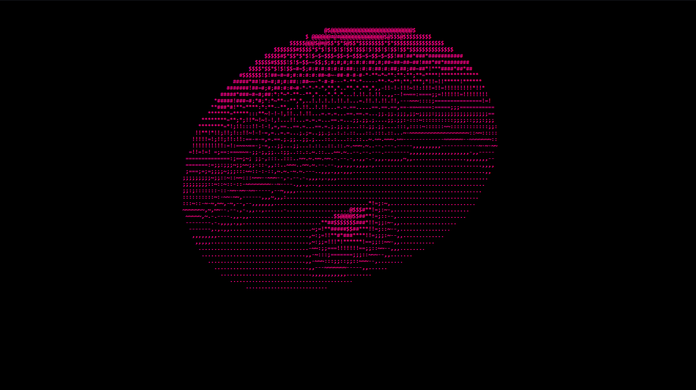
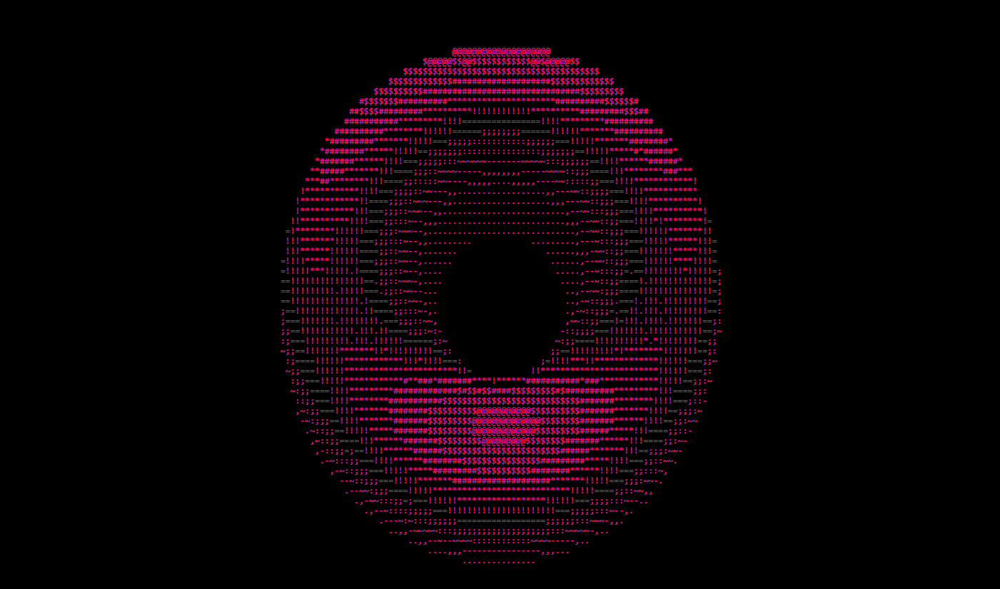

<div align="center">

# 🍩 Donut Animation

### A real-time rotating ASCII 3D donut rendered entirely with Vanilla JavaScript.



<br>


</div>

---

# 📖 About

This project recreates the famous **ASCII Donut**, a rotating 3D torus rendered entirely with characters using mathematical projection and real-time animation.

Instead of relying on Canvas, WebGL or external libraries, every frame is generated through trigonometric calculations and rendered directly inside a `<pre>` element using pure JavaScript.

---

# ✨ Features

- 🍩 Real-time rotating ASCII donut
- ⚡ Built with Vanilla JavaScript
- 📐 Mathematical 3D projection
- 💡 ASCII lighting simulation
- 🎨 Responsive centered layout
- 🚀 No frameworks or dependencies

---

# 🛠️ Technologies

- HTML5
- CSS3
- JavaScript (ES6)

---

# 📷 Screenshot

<div align="center">



</div>

---

# 🚀 Getting Started

Clone this repository:

```bash
git clone https://github.com/yngtavin/donut-animation.git
```

Open the project folder:

```bash
cd donut-animation
```

Finally, open the `index.html` file in your browser.

---

# 📂 Project Structure

```text
donut-animation
│
├── assets
│   ├── preview.gif
│   └── screenshot.png
│
├── index.html
├── style.css
├── index.js
├── README.md
├── LICENSE
└── .gitignore
```

---

# 🧠 How It Works

The animation is generated through mathematical equations that:

- Calculate the 3D coordinates of a torus.
- Rotate the object continuously.
- Project the 3D coordinates into 2D space.
- Simulate lighting using ASCII characters.
- Render every frame inside a `<pre>` element.

---

# 🌟 Inspiration

Inspired by the classic ASCII Donut algorithm by **Andy Sloane**, recreated using modern JavaScript.

---

<div align="center">

### 👨‍💻 Developed by

# **Otávio Amaro**

If you enjoyed this project, consider leaving a ⭐ on the repository.

</div>